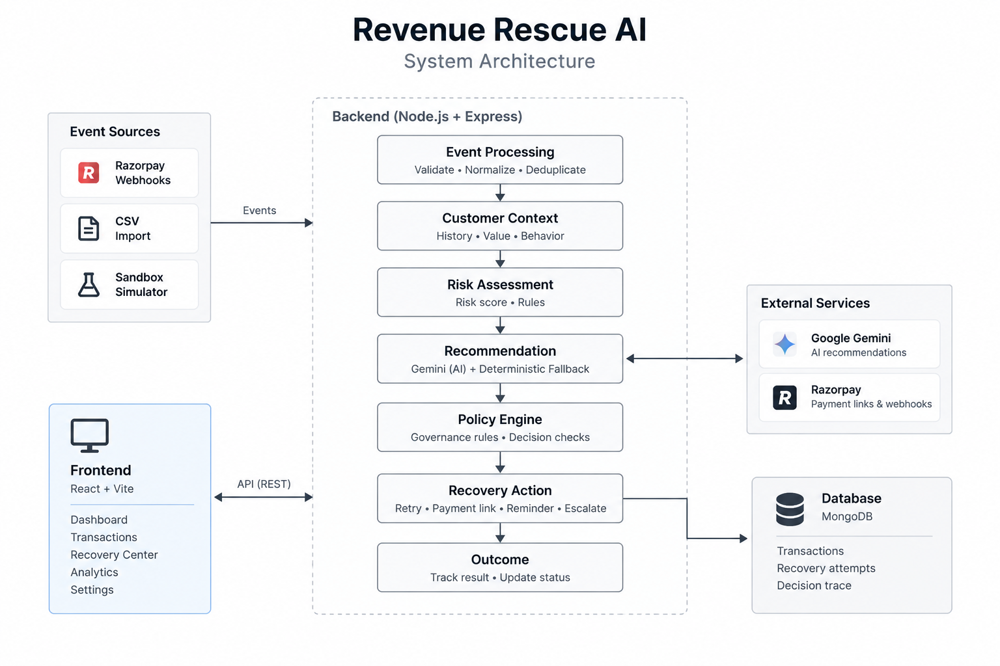
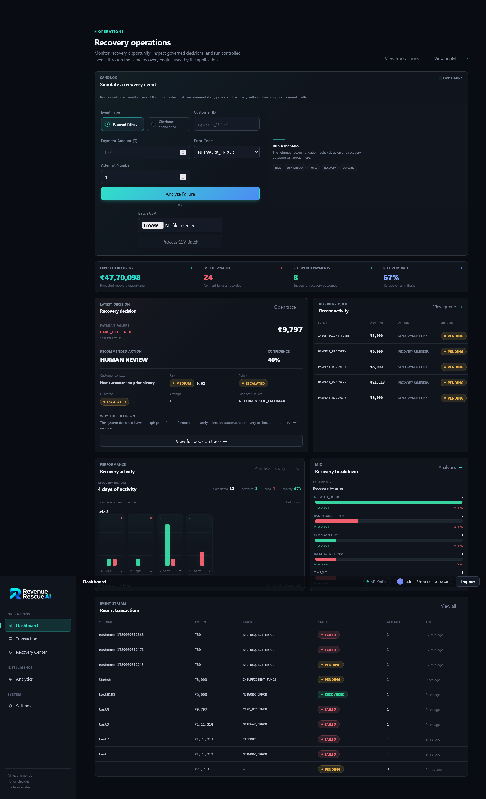
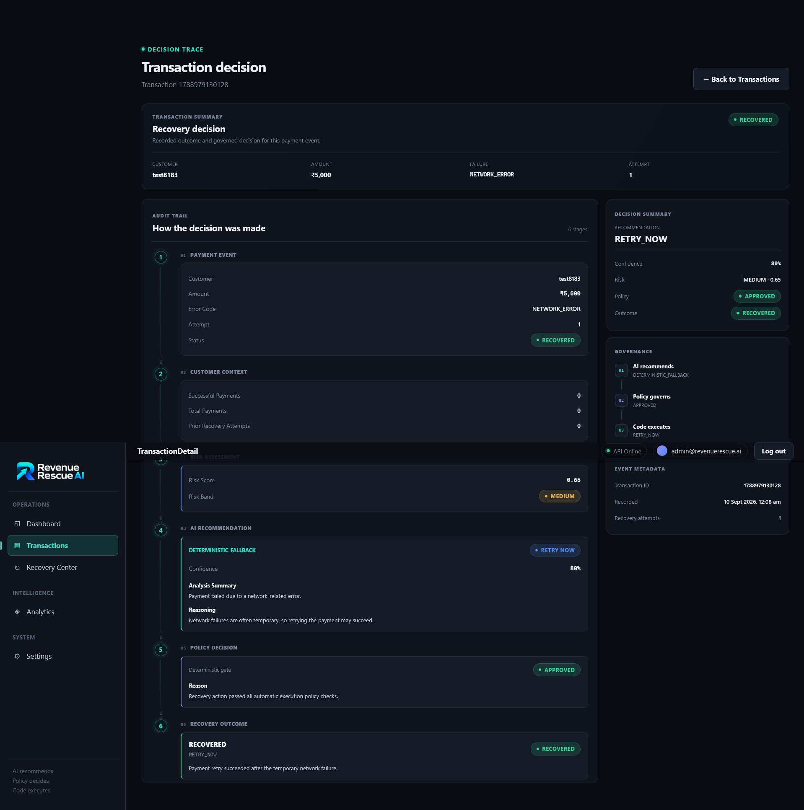
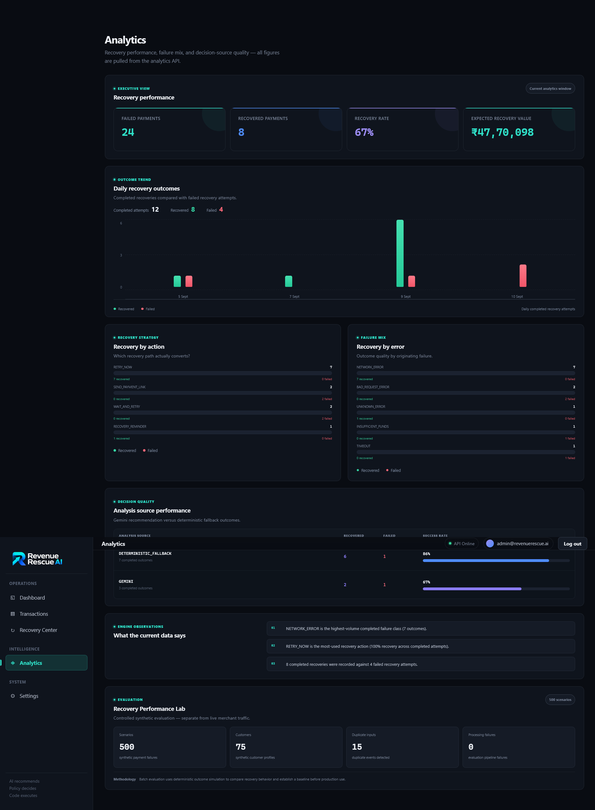

# Revenue Rescue AI

**Payment Recovery & Decision Governance Platform**

Revenue Rescue AI turns failed payments and abandoned checkouts into governed recovery decisions. It combines customer context, deterministic risk assessment, AI-assisted recommendations, policy controls, bounded recovery actions, and full decision tracing.

> **AI recommends. Policy decides. Code executes.**

[Live Demo](https://revenue-rescue-ai-eight.vercel.app/) · [GitHub Repository](https://github.com/DebugMajor/revenue-rescue-ai) · [Backend](https://revenue-rescue-ai-whqw.onrender.com)

---

## Overview

Payment failures do not all deserve the same response. A temporary network error may be safe to retry, an insufficient-funds failure may require an alternative payment method, while an unfamiliar or high-risk failure may need human review.

Revenue Rescue AI models that process as a governed pipeline:

```text
Payment / Checkout Event
          ↓
      Normalization
          ↓
    Customer Context
          ↓
    Risk Assessment
          ↓
Recommendation / Fallback
          ↓
     Policy Decision
          ↓
     Recovery Action
          ↓
        Outcome
          ↓
     Decision Trace
          ↓
       Analytics
```

Events can enter through Razorpay webhooks, CSV batch imports, or the built-in sandbox. All sources are routed through the same backend processing pipeline.

---

## Core Design Principle

The project deliberately separates AI from financial execution.

```text
AI Recommendation
       ↓
Deterministic Policy Gate
       ↓
Bounded Execution
```

Gemini may recommend an action, but it cannot bypass deterministic controls. Recommendations are validated before reaching the policy layer, and a deterministic fallback keeps the pipeline functional when AI is unavailable or its output is unusable.

This makes the system easier to reason about, audit, and demonstrate than an architecture where an LLM directly controls recovery actions.

---

## Key Features

### Payment Failure Recovery

The platform supports governed recovery decisions for scenarios including:

| Failure Scenario | Example Recovery Path |
|---|---|
| `NETWORK_ERROR` | `RETRY_NOW` → recovered when successful |
| `TIMEOUT` | `WAIT_AND_RETRY` → pending |
| `INSUFFICIENT_FUNDS` | `SEND_PAYMENT_LINK` → pending until payment |
| `GATEWAY_ERROR` | Governed recovery decision |
| Unknown / unsupported failure | `HUMAN_REVIEW` → `ESCALATED` |

The recovery action is determined by policy rather than directly trusting an AI recommendation.

### Abandoned Checkout Recovery

Abandoned checkouts are treated as first-class events:

```text
CHECKOUT_ABANDONED
        ↓
Risk Assessment
        ↓
Recommendation / Fallback
        ↓
Policy
        ↓
RECOVERY_REMINDER
        ↓
PENDING
```

A subsequent successful payment can resolve the pending recovery.

### AI Recommendation + Deterministic Fallback

Gemini recommendations are structured around:

- Recommended action
- Confidence
- Analysis summary
- Reasoning

AI output is validated before policy evaluation. When Gemini is unavailable or returns unusable output, deterministic fallback logic continues the workflow.

### Policy Governance

The policy layer is the hard boundary between recommendation and execution. It evaluates conditions such as:

- Transaction amount
- Risk level
- Previous recovery attempts
- Maximum attempt limits
- Allowed recovery actions
- Escalation conditions

A policy failure can prevent automatic execution and route the transaction to human review.

### Decision Trace

Every processed transaction records a six-stage decision path:

```text
1. Payment Event
2. Customer Context
3. Risk Assessment
4. AI Recommendation / Fallback
5. Policy Decision
6. Recovery Outcome
```

This provides an auditable explanation of how each recovery decision was reached.

### Razorpay Integration

The production backend supports Razorpay payment and Payment Link lifecycle events with:

- Raw-body webhook handling
- HMAC-SHA256 signature verification
- Webhook event idempotency
- Payment failure and capture processing
- Payment Link creation and lifecycle handling
- `paid`, `partially_paid`, `expired`, and `cancelled` states

The current Razorpay integration is configured for **one connected merchant account** through a configured webhook owner. The broader architecture can be extended to support per-merchant credentials and webhook ownership.

### CSV Batch Processing

CSV imports process multiple payment or checkout events through the same pipeline used by live webhooks and the sandbox.

Batch results include:

- Processed events
- Recovered events
- Pending events
- Escalated events
- Invalid rows
- Duplicate events

### Evaluation

The project includes a deterministic synthetic evaluation suite covering:

- **500 unique scenarios**
- **75 customers**
- **15 deliberate duplicate event IDs**
- Failure, timeout, gateway, insufficient-funds, and high-risk cases
- Maximum-attempt boundary conditions
- Policy boundary conditions
- Baseline comparison
- Gemini vs deterministic fallback comparison

The evaluation is designed to measure recovery outcomes, policy compliance, duplicate handling, and behavior at decision boundaries.

---

## Architecture



```text
                    ┌───────────────┐
                    │   Razorpay    │
                    └───────┬───────┘
                            │ Webhooks
                            ↓
┌──────────────┐     ┌────────────────────┐
│   Frontend   │ ──→ │   Node / Express   │
│ React + Vite │     │ Processing Pipeline │
└──────────────┘     └──────────┬─────────┘
                                │
             ┌──────────────────┼──────────────────┐
             ↓                  ↓                  ↓
        ┌──────────┐       ┌──────────┐       ┌──────────┐
        │ MongoDB  │       │  Gemini  │       │  Policy  │
        │  Atlas   │       │   API    │       │  Engine  │
        └──────────┘       └──────────┘       └──────────┘
```

### Application Stack

```text
React + Vite
     │
     │ HTTP / JSON
     ↓
Node.js + Express
     │
     ├── Authentication
     ├── Event Normalization
     ├── Customer Context
     ├── Risk Assessment
     ├── Recommendation / Fallback
     ├── Policy Engine
     ├── Recovery Execution
     └── Analytics
     │
     ├───────────────┐
     ↓               ↓
  MongoDB         External APIs
                  ├── Razorpay
                  └── Gemini
```

---

## Screenshots

### Dashboard



### Decision Trace



### Analytics



---

## Security

Implemented security controls include:

- JWT authentication
- User-scoped transaction and event access
- Protected API routes
- Cross-user access isolation
- Razorpay webhook HMAC verification
- Webhook idempotency using provider event IDs
- Environment-based secrets
- No credentials committed to the repository

---

## Tech Stack

### Frontend

- React
- Vite
- Bootstrap
- Font Awesome

### Backend

- Node.js
- Express
- MongoDB
- Mongoose
- JWT

### Integrations

- Razorpay
- Google Gemini

### Development

- JavaScript
- REST APIs
- CSV processing
- Git / GitHub

---

## Repository Structure

```text
revenue-rescue-ai/
├── frontend/
│   ├── src/
│   │   ├── components/
│   │   ├── pages/
│   │   ├── services/
│   │   └── styles/
│   └── package.json
│
├── server/
│   ├── controllers/
│   ├── middleware/
│   ├── models/
│   ├── routes/
│   ├── services/
│   ├── test/
│   └── server.js
│
├── docs/
│   ├── screenshots/
│   │   ├── analytics.png
│   │   ├── architecture.png
│   │   ├── dashboard.png
│   │   └── decision-trace.png
│   └── RevenueRescue-Learning.md
│
├── .gitignore
└── README.md
```

---

## Local Development

### Prerequisites

- Node.js
- MongoDB / MongoDB Atlas
- Razorpay account for webhook and payment testing
- Gemini API key for AI recommendations

### 1. Clone the Repository

```bash
git clone https://github.com/DebugMajor/revenue-rescue-ai.git
cd revenue-rescue-ai
```

### 2. Backend Setup

```bash
cd server
npm install
```

Create `server/.env`:

```env
MONGODB_URI=your_mongodb_connection_string
JWT_SECRET=your_jwt_secret
JWT_EXPIRES_IN=2h

RAZORPAY_KEY_ID=your_razorpay_key_id
RAZORPAY_KEY_SECRET=your_razorpay_key_secret
RAZORPAY_WEBHOOK_SECRET=your_razorpay_webhook_secret

GEMINI_API_KEY=your_gemini_api_key
WEBHOOK_USER_ID=your_webhook_user_id
```

Start the backend:

```bash
node server.js
```

The backend runs on `http://localhost:5000` by default.

### 3. Frontend Setup

Open another terminal:

```bash
cd frontend
npm install
npm run dev
```

The Vite development server will provide the frontend URL.

---

## Production Deployment

The deployed application uses:

- **Frontend:** Vercel
- **Backend:** Render
- **Database:** MongoDB Atlas
- **Payments / Webhooks:** Razorpay
- **AI:** Google Gemini

### Production URLs

- Frontend: https://revenue-rescue-ai-eight.vercel.app/
- Backend: https://revenue-rescue-ai-whqw.onrender.com

Production secrets are configured through hosting-provider environment variables and are not committed to the repository.

### Razorpay Webhook Flow

```text
Razorpay Event
      ↓
Production Webhook Endpoint
      ↓
Raw Body + HMAC Verification
      ↓
Provider Event Idempotency Check
      ↓
Event Normalization
      ↓
Common Revenue Rescue Pipeline
      ↓
Decision Trace + Outcome
```

---

## Demo Flow

A concise product demonstration can be run from the dashboard:

```text
1. Login
   ↓
2. Open Dashboard
   ↓
3. Submit a controlled failure or checkout event
   ↓
4. Run the recovery pipeline
   ↓
5. Review customer context and risk
   ↓
6. Review AI recommendation / fallback
   ↓
7. Inspect the deterministic policy decision
   ↓
8. Review recovery action and outcome
   ↓
9. Open Decision Trace
   ↓
10. Review aggregate performance in Analytics
```

### Recommended Demo Scenarios

**Automated recovery**

```text
NETWORK_ERROR
   ↓
RETRY_NOW
   ↓
RECOVERED
```

**Pending recovery**

```text
TIMEOUT
   ↓
WAIT_AND_RETRY
   ↓
PENDING
```

**Alternative payment path**

```text
INSUFFICIENT_FUNDS
   ↓
SEND_PAYMENT_LINK
   ↓
PENDING
```

**Governed escalation**

```text
Unknown / unsupported failure
   ↓
HUMAN_REVIEW
   ↓
ESCALATED
   ↓
NOT EXECUTED
```

**Live integration**

A Razorpay Test Mode `payment.failed` event can be sent to the deployed webhook endpoint and then inspected in Transactions and Decision Trace.

---

## Project Status

The core platform is implemented, deployed, and tested across:

- Payment failure recovery
- Abandoned checkout recovery
- CSV batch processing
- Razorpay webhook ingestion
- Payment Link lifecycle handling
- Authentication and user isolation
- Policy enforcement
- Recovery execution
- Decision tracing
- Analytics
- Synthetic evaluation scenarios
- Responsive layouts
- Production deployment

The project is intentionally kept as a single full-stack application with one governed processing pipeline rather than introducing unnecessary microservices or infrastructure.

---

## License

This project is intended for educational, portfolio, and demonstration purposes.
